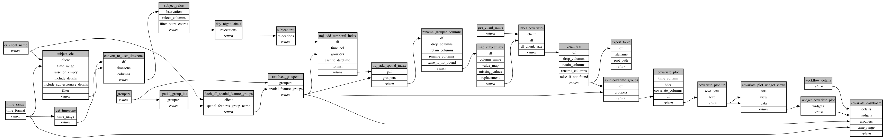

```
# AUTOGENERATED BY ECOSCOPE-WORKFLOWS; see fingerprint in README.md for details

```

```yaml
# fingerprint:
artifacts_sha256_basic: 873b5e3752a5505ef58c0075a2fe1242cf7a5fad4ba9ba27d0fcc6d970151174
artifacts_sha256_strict: 0fb75d69fb4a7874f522906af678c3c3d9c3c4bc128a5e3f62cf3c80799567d3
installed_requirements:
- channel: https://repo.prefix.dev/ecoscope-workflows/
  name: ecoscope-platform
  version: {version: ==2.16.1}
- channel: conda-forge
  name: pydeck
  version: {version: ==0.9.2}
params_sha256: 68a359a31e13fd85b2977fb99aed6f54c80311d1ac0e262101c84644d3174e8f
spec_sha256: 812fb29f0a54dd59b84a3781b197ea4790f6242a51cc2d4497ef85dee4b8b3fa

```

# ecoscope-workflows-subject-trajectory-covariate-labeling-workflow


